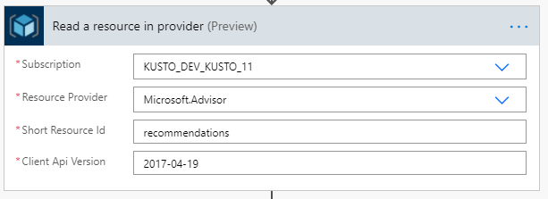
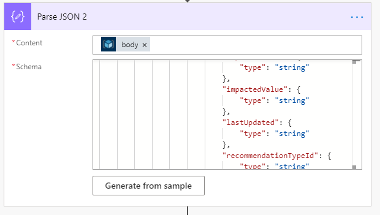

# How to automatically implement Advisor recommendations

In this post you will learn how to create a Flow that would automatically get Advisor recommendations and act on them.

## What is Azure Advisor and why should I automate its recommendations?

[Azure Advisor](https://docs.microsoft.com/en-us/azure/advisor/advisor-overview) a personalized cloud consultant that helps you follow best practices to optimize your Azure deployments. It analyzes your resource configuration and usage telemetry and then recommends solutions that can help you improve the cost effectiveness, performance, Reliability, and security of your Azure resources.

Kusto has recently introduced several valuable recommendations such:
* Recommendation to change the SKU and instances count based on your usage
* Recommendation to suspend or delete an cluster that is not used
* Recommendation to change table caching 

These recommendations are highly valuable to be able to save costs or improve the cluster's perfomance. 

Such recommendations *are based on your usage*, so they keep being added/removed based on your usage. It's recommended to address these recommendations and help you both improve cluster performance (for instance if we notice your cluster is lacking resources to perform its queries/ingestion we would recommend a higher SKU), and improve the cluster's costs (for instance if we notice your cluster is not used, we recommend suspending it etc).

One of the options is going over the recommendations manually one by one every some time, and acting on them. Another option which I will show in this post, is to automatically act upon recommendations you would like to implement.

## Which recommendations should be automated

Azure Advisor has multiple recommendations, and they are categorized into cost effectiveness, performance, Reliability, and security categories. You can choose to implement only the cost recommendations, or a specific recommendation you trust. For instance, you may want to only manually act on the "delete cluster" recommendations and make sure you really want to delete them, but implementing the suspend recommendations, and the SKU+instances recommendations may be a good option, and will both help optimized your usage, and save your time so you would not need to manaully act on them each time. 

You can also choose the best time for the automation to implement these recommendations to make sure they do not cause any interruptions, and setting them to run on weekends. 

## How to build the automation

We start with the trigger. As specified above, you may choose to act on the recommendations only when you know your clusters are not being used, during the night or weekends. Choose this time as the trigger time.

If you are working at different times and do not want to commit to specific hours, you can also configure the trigger to be a button on your phone. Whenever you choose you can click the button on your phone to implement the recommendations. 

In this post, I’ll use a Recurrence trigger.

1. The first thing we want to do is navigate to the [Microsoft Flow site](https://preview.flow.microsoft.com/en-us/), click on "My Flows"-> "+ New" -> Create from Blank

    

1. Add the new "Recurrence" trigger as the first action.

    

    Choose the times when you want the recommendations to be implemented.

1. Add a "Azure Resource Manager - Read a resource in provider" action and provide the subscription you would like to optimize.

    | Setting   | Description and value   |
    | --------- | ----------------------- |
    | **Subscription** | The subscription you would like to optimize. |
    | **Resource Provider** | Use 'Microsoft.Advisor' |
    | **Short Resource Id** | Use 'recommendations' |
    | **Client API version** | Use the latest Advisor API version, for instance currently it's 2017-04-19. |

    

1. The previous step will return the list of Advisor recommendations in the given subscription. To decide on which recommendations to act on we would need to parse the results. To do that, we will use the parse json action. 

Add a 'Data Operation - parse JSON' action. In the Content provide it with the 'body' dynamic object with the Advisor recommendations from the previous step, and let it generate the schema by itself, by clicking the 'Generate from sample' and provide it with a sample of the recommendations.

To get the sample, I used armclient and ran the same REST call we used in previous step to get all the recommendations 

`armclient GET https://management.azure.com/subscriptions/yoursubscriptionid/providers/Microsoft.Advisor/recommendations?api-version=2017-04-19`

> Tip: to learn how to use armclient, you can read more on my post on [How to configure automatic autoscale on your cluster using armclient](blogs/UseRestToEnableOptimizedAutoscale.md)

1. In the next step we would want to iterate over the parsed recommendations, and decide whether we want to act on them or not. 

For instance, I decided I want to automate all the recommendations that are recommended for Kusto resources, so I used "impactedType" Microsoft.Kusto/Clusters. I also chose to only automate the change SKU recommendations, in the category of performance, so I compared the recommendationType to the specific da4d47d5-b48b-4308-93bc-29d954424e76 GUID (you can find all the GUIDs by running get on the recommendations using armclient as explained above).

1. In the next step, if the conditions are true, we would want to act on them. To be able to act on the recommendation and change the SKU we also need the location of the cluster which currently is not one of the properties we get from the recommendation. So we need to add another action to get the cluster that we want to change, get its location, then add another action to actually change its sku and instances count to the recommended properties.
    1. Add a 'Azure Resource Manager - Read a resource' operation, and add the information on the cluster we want to optimize.

    | Setting   | Description and value   |
    | --------- | ----------------------- |
    | **Subscription** | Use the dynamic expression: 'split(items('Apply_to_each_2')?['properties']?['resourceMetadata']?['resourceId'], '/')[2]' which would return the subscription id of the cluster we want to optimize. |
    | **Resource Group** | Use the dynamic expression: 'split(items('Apply_to_each_2')?['properties']?['resourceMetadata']?['resourceId'], '/')[4]' which would return the resource group of the cluster we want to optimize. |
    | **Resource Provider** | Use 'Microsoft.Kusto' |
    | **Short Resource Id** | Use 'clusters/split(items('Apply_to_each_2')?['properties']?['resourceMetadata']?['resourceId'], '/')[8]'. This would return something like 'clusters/clustername' of the cluster you want to optimize. |
    | **Client API version** | Use the latest Kusto API version, for instance currently it's 2020-09-18. | 

    1. Add a 'Azure Resource Manager - Create or update a resource' operation, and add the information on the cluster we want to optimize.
    
    | Setting   | Description and value   |
    | --------- | ----------------------- |
    | **Subscription** | Use the dynamic expression: 'split(items('Apply_to_each_2')?['properties']?['resourceMetadata']?['resourceId'], '/')[2]' which would return the subscription id of the cluster we want to optimize. |
    | **Resource Group** | Use the dynamic expression: 'split(items('Apply_to_each_2')?['properties']?['resourceMetadata']?['resourceId'], '/')[4]' which would return the resource group of the cluster we want to optimize. |
    | **Resource Provider** | Use 'Microsoft.Kusto' |
    | **Short Resource Id** | Use 'clusters/split(items('Apply_to_each_2')?['properties']?['resourceMetadata']?['resourceId'], '/')[8]'. This would return something like 'clusters/clustername' of the cluster you want to optimize. |
    | **Client API version** | Use the latest Kusto API version, for instance currently it's 2020-09-18. | 
    | **Location** | Use dynamic expression 'Location' taken from the previous action. | 

1. Save the flow.

1. Try it out, by clicking the "Test" at the top right. After the flow completes, you will see your recommendations has been automatically implemented.

That’s it! You have now configured a flow that automatically acts on the Kusto Advisor recommendations and optimizes your usage! 

For more information regarding using Flow with Azure Data Explorer (Kusto) see: [Azure Kusto Flow Connector](https://docs.microsoft.com/en-us/azure/kusto/tools/flow).