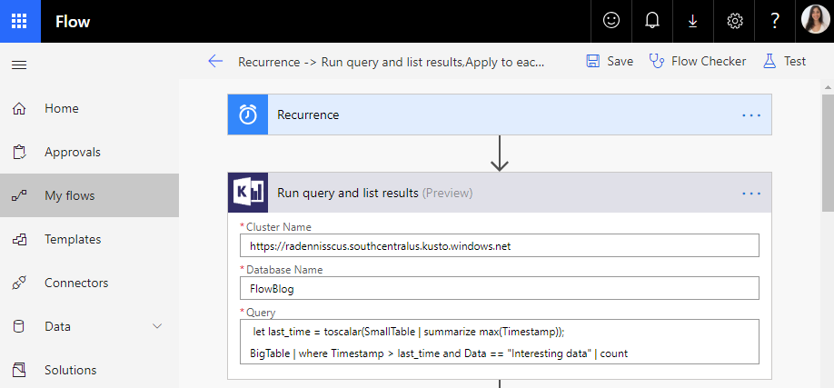
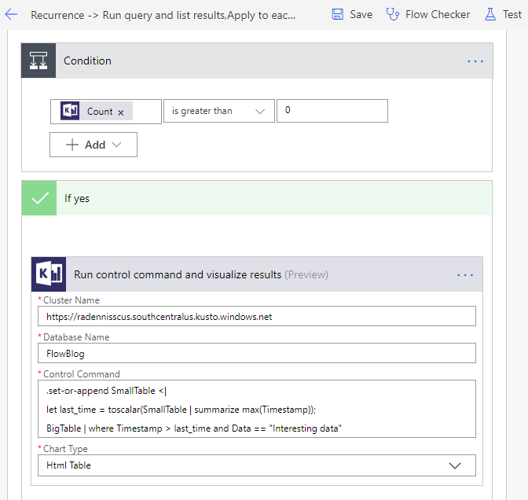

# How to automate Kusto (Azure Data Explorer) queries

In this blog you would learn how to automate Kusto queries/control commands.

## Why should you use Kusto Flow

I've seen many customers looking for automating their Kusto queries and control commands. Here's a small list of things I've seen customers benefit from Kusto Flow, that you might find useful as well.

### Getting a digest of data in an email

As an engineer/manager you might be data driven and want to look at data to decide which incidents happen more often and should be looked at, which features are being used the most, what feedbacks your feature got, etc. I for instance use that feature massively to debug my features.
Instead of waking up every morning and querying the data, you could just setup a Flow to inform you of what you're most interested in.
You might want to do that on a daily basis, or even get the email [only when something actually happens](https://docs.microsoft.com/en-us/azure/kusto/tools/flow#example-7---create-custom-html-table).
[Here's](https://docs.microsoft.com/en-us/azure/kusto/tools/flow#example-7---create-custom-html-table) an example of how to do that.

### Ingesting data from another source into/from Kusto

I've seen many customers looking into moving their data from one place to another. For instance, you data may reside in Kusto and you might want to use it in SQL as well, instead of ingesting the data both into Kusto and into SQL you could just ingest it into Kusto and have Flow ingest any data being ingested into SQL as well. And the other way around of course.

To do that, you could just setup a Flow that would run every once in a while and would ingest new data into SQL. See [here](https://docs.microsoft.com/en-us/azure/kusto/tools/flow#example-7---create-custom-html-table) for more information about it.

### Save digested data into a smaller table

Some customers have a very large table with all the telemetry of a certain product. To save costs they usually save the data of that table for short period of time but would still like to keep some important data for longer periods. 
To do that, you can create a Flow to query the large table and ingest the output of the data into another table, which keeps data for longer time periods.

I will explain how to do that next.

## How to save digested data into a smaller table

### Overview

In this example I would show you how to automatically ingest important data from a "big table" into a "small table". Our flow would run every hour and would check if there is new data ingested into the "big table", if not, it would not do anything. 
If there is new data, it would ingest the new data into the smaller table.

For this purpose I would use my Kusto cluster "radennisscus", and a database called "FlowBlog".
Note that for the "cluster name" below I would use the URI that appears on the "cluster overview page" under "URI"


For this example, my BigTable contains 23 records


The BigTable includes two kinds of records. "Not interesting data" and "Interesting data".


The flow would ingest only the "Interesting data" records into the SmallTable.

### Trigger

When using Kusto and Flow the first thing you would want is a trigger, meaning when should the Flow happen. You might want it to happen on a scheduled basis, in that case you would want to use a ["Recurrence" trigger](https://docs.microsoft.com/en-us/azure/kusto/tools/flow#example-7---create-custom-html-table). You might want to trigger the flow manually, for instance in case someone ask you what is the current number of users of your product, you can add a [button](https://docs.microsoft.com/en-us/flow/introduction-to-button-flows) on your phone, that when you click, sends you an email with the current number of users.

For this example I would use a "Recurrence" trigger, to check every once in a while whether there is new data ingested.

So first thing we would want to do is navigate to [Flow's site](https://preview.flow.microsoft.com/en-us/), click on "My Flows"-> "+ New" -> Create from Blank


Then we would add the new "Recurrence" trigger as the first action.


Then we would run a query on the large table to see whether there is new data ingested into it. 
For that purpose we would need to use the "Run query and list results" action which runs a query (meaning it should not start with a dot, or else it is a control command) and lists its results in raw way. We need to use that to get the actual number of results.

After adding the action, add the cluster URI, the database name and the table name where the data resides.
In the Query section, I would use the following query which counts how many new records exist in the BigTable. The query first checks what is the last time records was ingested to the SmallTable, by getting the maximum time of the records, and then checking if there are newer records in the BigTable.

```Kusto
 let last_time = toscalar(SmallTable | summarize max(Timestamp));
BigTable | where Timestamp > last_time and Data == "Interesting data" | count
```



Next we need to add a condition, on the result, if there is new data we would ingest the data into the small table, else we will not do anything.

To do that add a new action and search for "condition"


When clicking the first box, you would be given the results of the previous Kusto action. Click on "count", "is greater than" and 0.
Clicking the count would automatically add an "Apply to each" action, that's because the result of the previous action is an array of results, on our case "count" returns just one line of results with the count, therefore the condition would actually run only once.


In the "If yes" add an action that ingests the interesting data into your SmallTable.
This time the query we needs to run is a control command. In that case we need to use the "Run control command and visualize results". We would use the same cluster name and database (for this, you can actually also use a different cluster/database is you want to transfer the data into another cluster) and the following query.

```Kusto
.set-or-append SmallTable <|
let last_time = toscalar(SmallTable | summarize max(Timestamp));
BigTable | where Timestamp > last_time and Data == "Interesting data"
```

Since the "Run control command and visualize results" actually visualizes the results, you would need to pick a chart type, you can just use an "Html Table", we would not use the results of this action.



We finished writing the Flow. Now you can click on the "save" button at the top right, to save the flow and manually trigger it to test it out, by clicking on "Test" -> I'll perform the manual trigger -> "Run flow"

After testing and making sure it works, you can just  enable the flow and it would run everyone hour.

That's it!

## Notes

1. You might find that the table/charts visualizations are not satisfying enough for your needs. In that case I would suggest using "Run kusto query and list results" and formatting the table yourself.

    See more information on how to achieve that [here](https://docs.microsoft.com/en-us/azure/kusto/tools/flow#example-7---create-custom-html-table)

1. If you have a more business need, and need more heavy actions available, such as adding code into the Flow, webhooks etc, you might want to consider using Kusto Flow action on [Logic Apps](https://azure.microsoft.com/en-us/services/logic-apps/). The same information provided in the Blog is relevant to Logic apps.

Please feel free to comment on what you'd be interested in me adding more information about next time.
