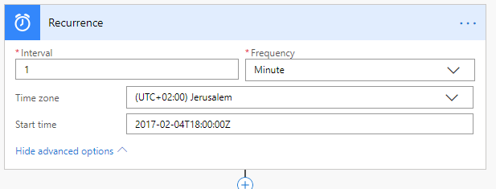
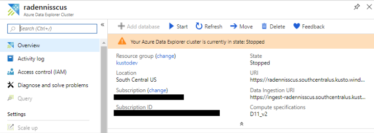

# How to auto-suspend your cluster

Azure Data Explore is worth your while, now see how you can get the best bang for your buck while using it. In this blog I show you how to trigger automatic stop and start calls for your Azure Data Explorer cluster which saves you $$$.

## Why should you read this

Everyone cares about costs right? One thing you can do to minimize your costs, if you know you aren't using your cluster at a certain time, configure a Flow that will automatically stop your cluster when it isn't being used. For example, you can stop your cluster at the end of your day and automatically start your cluster before you get to work. How cool is that, ha?

### How to build the automation

We start with the trigger. Do you have specific times that you won’t be using your cluster? For instance, if you only use your cluster during work times between 8AM and 6PM, use a Recurrence trigger to stop your cluster at 6 PM and start it at 8 AM.

If you are working at different times and do not want to commit to specific hours, you can also configure the trigger to be a button on your phone. When you leave work in the evening, click the stop button on your phone and start it when you’re on your way to work in the mornings.

In this post, I’ll use a Recurrence trigger.

1. The first thing we want to do is navigate to the [Microsoft Flow site](https://preview.flow.microsoft.com/en-us/), click on "My Flows"-> "+ New" -> Create from Blank

    

1. Add the new "Recurrence" trigger as the first action.

    

    Choose the times when you plan to stop using your cluster.

1. Add a "Azure Resource Manager - Invoke resource operation" action and provide the information required, such as your cluster's subscription, resource group, and resource id.

    | Setting   | Description and value   |
    | --------- | ----------------------- |
    | **Subscription** | Your cluster's subscription id. |
    | **Resource Group** | The resource group where your cluster is located. |
    | **Resource Provider** | Microsoft.Kusto |
    | **Short Resource id** | Provide the short resource id of your cluster. Format: clusters/{clusterName}. |
    | **Client API version** | Use the latest Kusto API version, for instance currently it's 2019-01-21. |
    | **Action Name** | "stop" to stop your cluster and "start" to start your cluster. |

    

1. Save the flow.

1. Try it out, by clicking the "Test" at the top right. After the flow completes,  you see that your cluster has been successfully stopped in the portal.

    

1. Now, we can continue to create another flow that would start your cluster.

    This flow will be very similar to the previous flow. You start by creating a trigger action, then add a “Azure Resource Manager - Invoke resource operation” action. Put the same values as the previous flow with one change. In the action name, put “start”.

That’s it! You have now configured a flow that stops your cluster during your off hours, and starts it even before you need it!

> Note: Starting the cluster would “warm” your data and will re-read it from cold storage into the cache. Therefore, it is suggested to allow time for that process to complete. Make sure you start your cluster with enough time (depending on the data and caching policy) before you are planning to use it.

For more information regarding using Flow with Azure Data Explorer (Kusto) see: [Azure Kusto Flow Connector](https://docs.microsoft.com/en-us/azure/kusto/tools/flow).