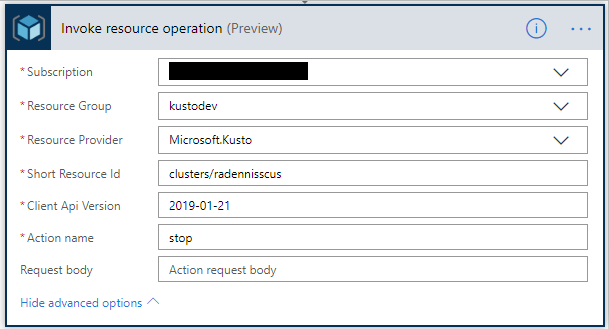

# How to save $$$ when using Azure Data Explorer

In this blog I would show you how to trigger automatic stop and start calls for your Azure Data Explorer cluster which would save you $$$.

## Why should you read this

Many of our customers are worried about the costs of an Azure Data Explorer cluster. One thing you could do, if you know you would not be using your cluster after end-of-day (or some other time) you could configure a Flow that would automatically stop your cluster by your end if your day and would automatically start your cluster before you get to work. How cool is that ha?

### First the trigger

We would start with the trigger. Do you have specific times you know you would not be using your cluster? For instance you only use your cluster during work times between 8AM and 6PM? Then you can use a Recurrence trigger to stop your cluster at 6 PM and start it back at 8 AM.

You might be working on different times and do not want to commit to specific hours. In that case, you could also configure the trigger to be a button on your phone, whenver you leave work just click the stop button on your phone, and start it when you're on your way to work.

In this post I'll use a Recurrence trigger.

So first thing we would want to do is navigate to [Flow's site](https://preview.flow.microsoft.com/en-us/), click on "My Flows"-> "+ New" -> Create from Blank

Then we would add the new "Recurrence" trigger as the first action.

Choose the times where you are planning to stop using your cluster.

Then add a "Azure Resource Manager - Invoke resource operation" action and provide the information required, such as your cluster's subscription, resource group, resource id.

| Setting   | Description and value   |
| --------- | ----------------------- |
| **Subscription** | Your cluster's subscription id. |
| **Resource Group** | The resource group where your cluster is. |
| **Resource Provider** | Microsoft.Kusto |
| **Short Resource id** | Provide the short resource id of your cluster which should be of the format clusters/{clusterName} |
| **Client API version** | Use the latest Kusto API version, for instance currently it's 2019-01-21. |
| **Action Name** | "stop" to stop your cluster and "start" to start your cluster. |

Save the flow.

You can try it out, by clicking the "Test" at the top right. After the flow completes you can see that your cluster has been successfully stopped in the portal.

Now we can continue to create another flow that would start your cluster.

This flow should be very similar to the previous flow. You should start by creating a trigger action, then add "Azure Resource Manager - Invoke resource operation" action. Put the same values as the previous flow with one change, in the action name put "start".

That's it, you configured a flow that would stop your cluster on your off hours, and would start it even before you notice it!